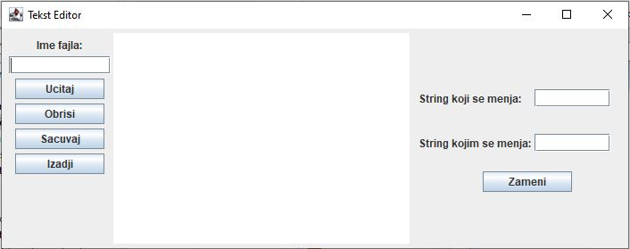
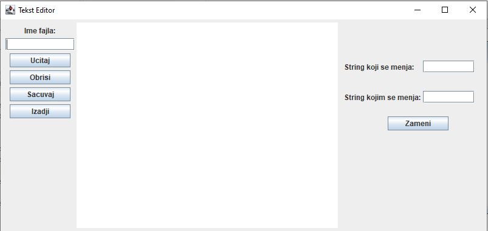
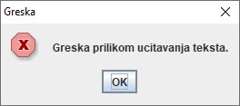
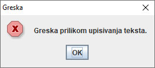
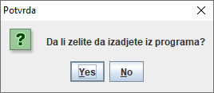
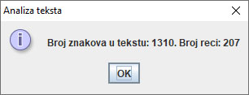

# Laboratorijske vežbe za dvočas br. 13

## Zadatak 1
*(radi ga laborant u saradnji sa studentima)*

Napraviti javnu klasu **TekstDemo** u paketu **zadatak1.poslovna_logika** koja ima:

1. Javnu metodu **ucitajTekst** koja kao ulazni argument prima naziv tekstualnog fajla. Ova metoda učitava sav tekst iz ovog fajla i vraća ga u vidu jednog String-a. Potrebno je obratiti pažnju na znak za kraj reda tj. povratni String treba da sadrži i znakove za kraj reda na kraju svakog reda. Ukoliko dođe do greške prilikom učitavanja, baciti odgovarajući izuzetak iz metode.

2. Javnu metodu **upisiTekst** koja kao ulazni argument prima dva String-a: prvi predstavlja naziv tekstualnog fajla, a drugi neki tekst. Ova metoda upisuje tekst u tekstualni fajl sa zadatim imenom. Ukoliko dođe do greške prilikom upisivanja, baciti odgovarajući izuzetak iz metode.

Napraviti vizuelnu klasu **TekstEditorGUI** u paketu **zadatak1.gui** koja izgleda kao na slici. Centralni deo ekrana bi trebalo da bude editor za tekst. Kada se promeni dimenzija forme, trebalo bi da se ovaj centralni deo poveća/smanji, a da ostale komponente ostanu na istom mestu kao na drugoj slici.

1. Klasa treba da ima privatni atribut **tekstDemo** tipa **TekstDemo** koji se inicijalizuje prilikom deklaracije.

2. Kada se klikne na dugme **Obriši**, briše se tekst koji se nalazi u editoru. 

3. Kada se klikne na dugme **Učitaj**, iz polja za unos se preuzima ime tekstualnog fajla, učitava se tekst iz tog fajla i prikazuje u okviru editora. Učitavanje je potrebno vršiti pozivanjem metode klase **TekstDemo**. U slučaju greške, prikazati JOptionPane dijalog sa porukom o greški.

4. Kada se klikne na dugme **Sačuvaj**, sav tekst koji se trenutno nalazi u editoru se upisuje u fajl čije ime se nalazi u polju za unos. Upisivanje je potrebno vršiti pozivanjem metoda klase **TekstDemo**. U slučaju greške, prikazati JOptionPane dijalog sa porukom o greški.

5. U poljima za unos sa desne strane forme korisnik unosi String koji treba zameniti i String kojim treba zameniti. 
Kada se klikne dugme **Zameni**, iz polja za unos preuzimaju se unete vrednosti i vrši se zamena svih pojavljivanja Stringa u tekstu u editoru.

6. Kada se klikne na dugme **Izadji**, prekida se izvršavanje programa. Prethodno pitati korisnika da li zeli da izadje iz programa preko JOptionPane dijaloga.

## Zadatak 2
*(studenti rade sami)*

1. Dodati dugme **Analiza**, na koje kada se klikne, prebrojava broj znakova i reči u tekstu i otvara se novi dijalog u kome se
prikazuju ovi podaci. 

